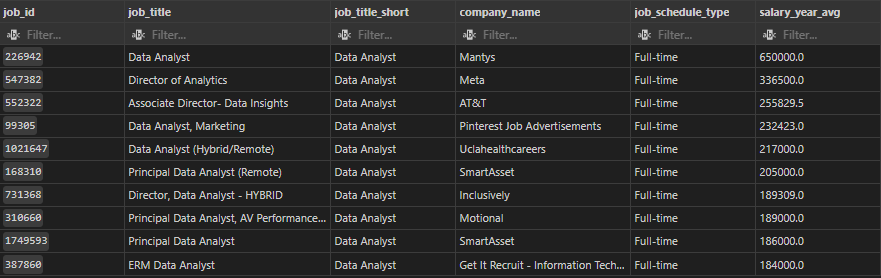
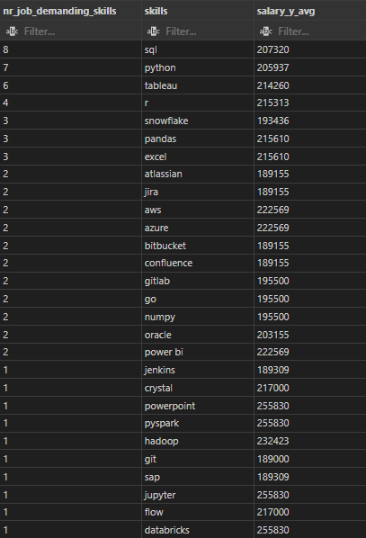
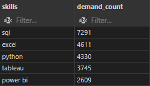
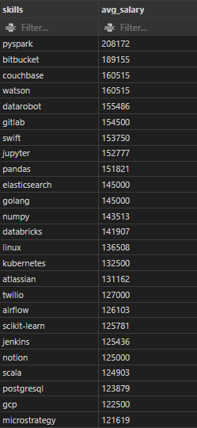
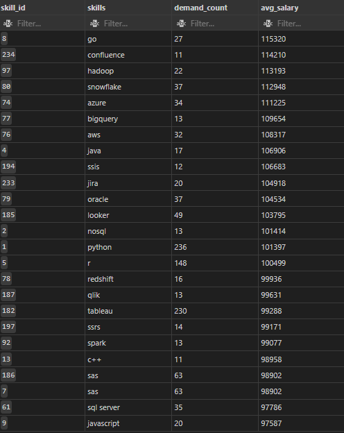

# Introduction

I have followed an excellent [SQL course](https://lukebarousse.com/sql) by Luke Barousse which explored top-paying Data Analyst jobs, the in-demand skills within the industry and investigated the intersection where high demand meets high salary in data analytics.


# Tools I Used

I have set up my local server in **PGAdmin**, created the tables and written the necessary SQL queries in **VS Code**.

I have opted for **Tableau** to visualise the results, you can check that on [my Tableau profile](https://public.tableau.com/app/profile/agnes.ujvari/viz/DataAnalystJobListings-PracticeProject/AnalysisofDataAnalystJobListings?publish=yes)
 
 For version control and sharing my scripts, I used **Git** and **Github**.

# The Analysis

### 1. Top Paying Data Analyst Jobs
   
I have narrowed my selection for those job listings that were for data analysts and provided remote working opportunity. Meanwhile I excluded those that did not offered information on salary.

As I intended to check the companies along salaries, I joined two tables on the unique identifier of the companies.

```sql
SELECT 
     job_id,
     job_title_short,
     company_dim.name as company_name,
     job_schedule_type,
     salary_year_avg
     
FROM 
    job_postings_fact
    LEFT JOIN company_dim ON job_postings_fact.company_id = company_dim.company_id
WHERE
    (job_title_short LIKE ('Data Analyst')) AND
    (salary_year_avg IS NOT NULL) AND
    job_work_from_home IS TRUE
ORDER BY
    salary_year_avg DESC
LIMIT 
    10
```
The major insights that could be provided are
- **wide salary range** from $184,000 to $650,000.
- **diverse employers** that show broad interest across different industries
  
  

<div style="text-align: center; padding: 2rem;">
    
    <p>Caption: This chart shows the top paying jobs in the industry.</p>
</div>

  
### 2. Skills for top-paying jobs

To identify the skills that are the most-demanded in these roles, I included the previous query as a nested query and I joined it to skills dimension table on job_id which led us to the demanded skills after I joined this dimension table on the skilss table on skill_id.
In order to see the number of jobs that demanded the particular skills, I grouped my results by skills.

```sql

SELECT 
     skills_dim.skills,
     ROUND(AVG(top_paying_jobs.salary_year_avg), 0) as salary_y_avg
FROM 
    (
    SELECT 
        job_id,
        job_title_short,
        company_dim.name as company_name,
        salary_year_avg
    FROM 
        job_postings_fact
        LEFT JOIN company_dim ON job_postings_fact.company_id = company_dim.company_id
    WHERE
        (job_title_short LIKE ('Data Analyst')) AND
        (salary_year_avg IS NOT NULL) AND
        job_work_from_home IS TRUE
    ORDER BY
        salary_year_avg DESC
    LIMIT 
        10) AS top_paying_jobs
    LEFT JOIN skills_job_dim on top_paying_jobs.job_id = skills_job_dim.job_id
    LEFT JOIN skills_dim on skills_job_dim.skill_id = skills_dim.skill_id
WHERE
    skills_dim.skills IS NOT NULL
GROUP BY 
    skills_dim.skills
ORDER BY
    nr_job_demanding_skills DESC;
```
 - Top skills in demand are **SQL** and **Python**, appearing in the most job postings (8 and 7, respectively), followed by  **Tableau** and **R**.

- Cloud and DevOps tools like **AWS**, **Azure**, **GitLab**, and **Jira** are also highly valued, showing the growing need for cloud and DevOps expertise.
  
<div style="text-align: center; padding: 2rem;">
    
    <p>This chart shows the skills demanded in the top paying jobs of the industry.</p>
</div>

### 3. In-demand skills


```sql
SELECT
    skills,
    count(*) as demand_count
FROM
    skills_dim
    LEFT JOIN  skills_job_dim ON skills_dim.skill_id = skills_job_dim.skill_id 
    LEFT JOIN  job_postings_fact ON skills_job_dim.job_id = job_postings_fact.job_id 
WHERE
    job_postings_fact.job_title_short = 'Data Analyst' AND
    job_postings_fact.job_work_from_home = true
GROUP BY
    skills_dim.skills
ORDER BY
    demand_count DESC
LIMIT 
    5;
```

- **SQL**, **Python** and **Excel** remain fundamental, emphasizing the needfor strong fundamental skills in data processing and spreadsheet manipulation.
- Visualisation tools like **Tableau** and **Power BI** are essential, pointing towards the increasing importance of technical skills in data storytelling and decision support.
<div style="text-align: center; padding: 2rem;">
    
    <p> This chart shows the most in-demand skills for Data Analysts.</p>
</div>

### 4. Top-paying skills

```sql
SELECT 
     skills,
     ROUND(AVG(salary_year_avg),0) AS avg_salary
FROM 
    job_postings_fact
    INNER JOIN skills_job_dim on job_postings_fact.job_id = skills_job_dim.job_id
    INNER JOIN skills_dim on skills_job_dim.skill_id = skills_dim.skill_id
    WHERE
        (job_title_short = 'Data Analyst') AND
        (salary_year_avg IS NOT NULL) AND
        (job_work_from_home IS TRUE)
    GROUP BY 
        skills
    ORDER BY
        avg_salary DESC
    LIMIT
        25
  ;
```

- High demand for cloud and big data technologies:
  - Skills like Databricks, GCP, Kubernetes, and Linux suggest a strong demand for cloud platforms and big data tools.
- Programming languages:
  - High-paying programming languages such as Python (pandas), PySpark, and Go (golang)  highlight their importance in data analysis and processing.

 - Machine learning & AI:
   - Tools related to machine learning and AI, like Watson, Databricks, scikit-learn, and Datarobot, indicate that machine learning and AI expertise is highly valued.
 - Version control and collaboration tools:
   - Bitbucket and GitLab  suggest that skills in version control and collaboration platforms are in demand.
 - Data visualization & reporting tools:
   - MicroStrategy shows the importance of advanced data visualization and reporting tools.
  
These trends reflect a strong emphasis on cloud computing, big data technologies, machine learning, and advanced data processing in the high-paying Data Analyst roles.

<div style="text-align: center; padding: 2rem;">
    
    <p> This chart shows skills with the highest average salary.</p>
</div>

### 5. Optimal skills

Combining insights from demand and salary data, this query aimed to pinpoint skilss that are both in high emand and have high salaries, offering a strategic focus for skill development.

```sql
SELECT  
    skills_dim.skill_id,
    skills_dim.skills, 
    COUNT(skills_job_dim.job_id) AS demand_count,
    ROUND(AVG(salary_year_avg),0) AS avg_salary
FROM
    job_postings_fact
    INNER JOIN skills_job_dim on job_postings_fact.job_id = skills_job_dim.job_id
    INNER JOIN skills_dim on skills_job_dim.skill_id = skills_dim.skill_id
 WHERE
    job_title_short = 'Data Analyst' AND
    salary_year_avg IS NOT NULL AND
    job_work_from_home IS TRUE
GROUP BY
    skills_dim.skill_id
HAVING
    COUNT(skills_job_dim.job_id) > 10
ORDER BY
    avg_salary DESC,
    demand_count DESC
LIMIT 
    25;
```

<div style="text-align: center; padding: 2rem;">
    
    <p> This chart showsthe most optimal skills sorted by salary.</p>
</div>

Here is a breakdown of the most optimal skills for Data Analyst in 2023. 

- High-demand programming languages are Python and R with out-standing average salaries and job listing counts.
- Skills in specialised technologies such as Snowflake, Azure, AWS and BigQuery show significant demand with relatively high average salaries, pointing towards the growing importance of cloed platforms and big data technologies in data analysis.
- Tableau and Looker highlight the cricital role of data visualisation and business intelligence.
- NoSQL databases reflects the enduring need for data storage, retrieve and management expertise.


# Conclusion

### Key Takeaways:
- Top-paying jobs for remote Data Analysts show a wide salary range, reflecting diverse industries and high demand.
- Essential skills include SQL, Python, Excel, and visualization tools like Tableau and Power BI.
- High-paying technologies such as Snowflake, Databricks, and cloud platforms (AWS, Azure) are in growing demand.
- Balanced skillsets combining technical expertise and storytelling ensure career success in data analytics.


